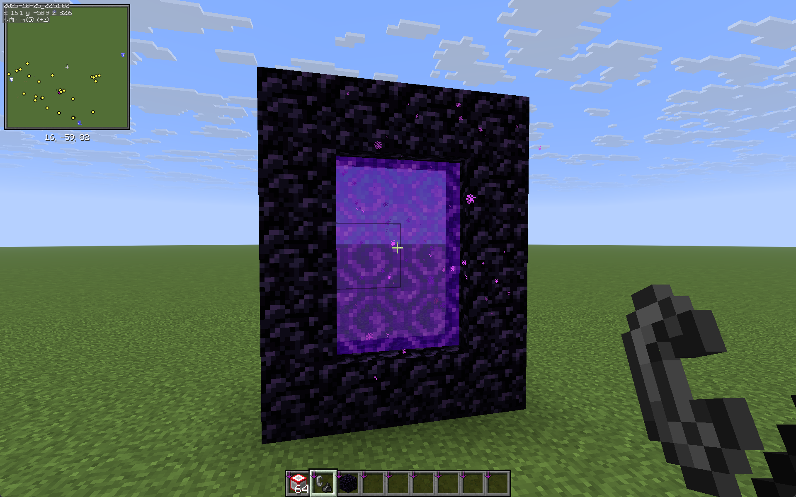
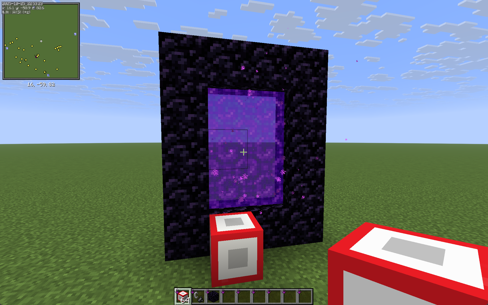
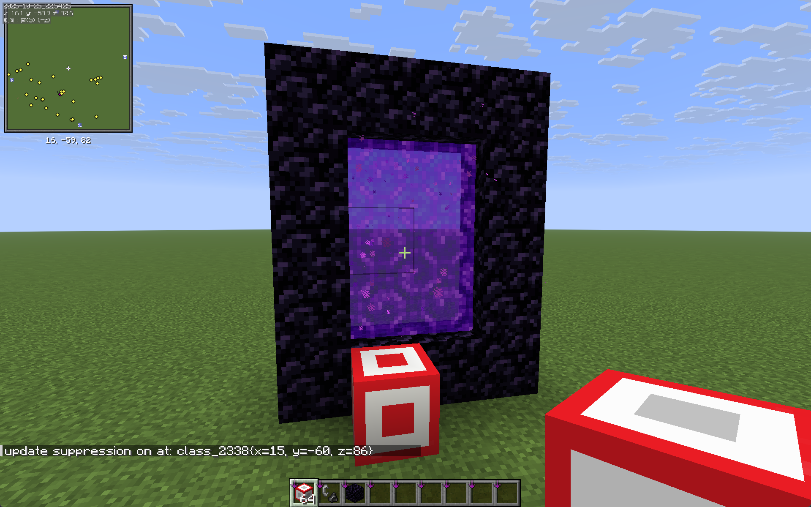
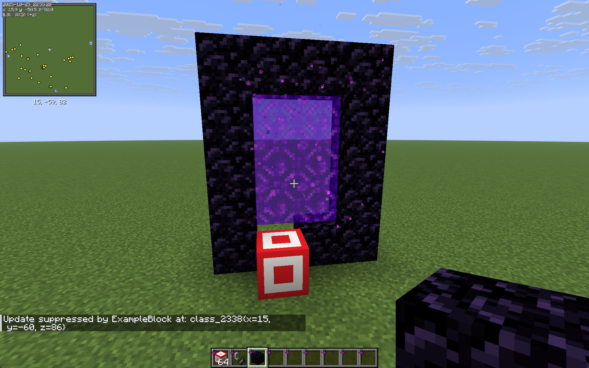
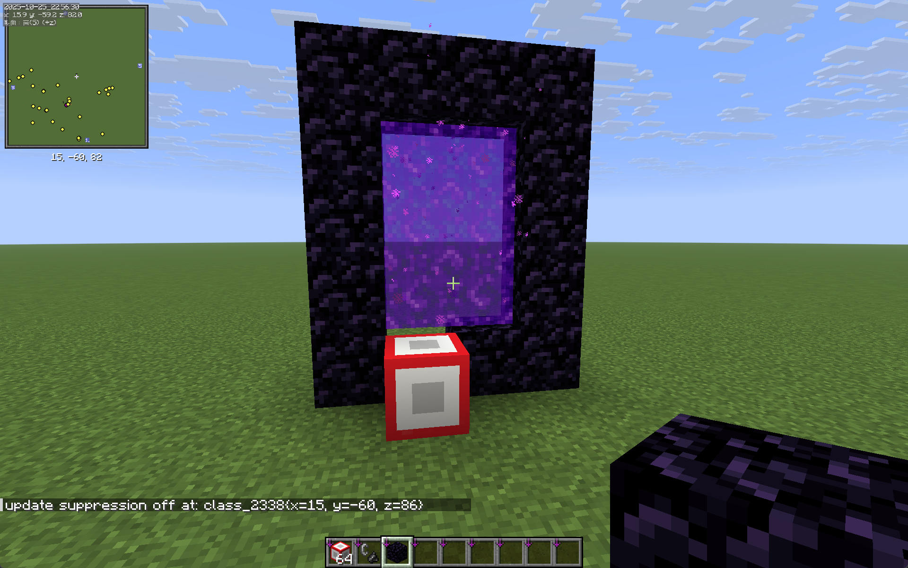
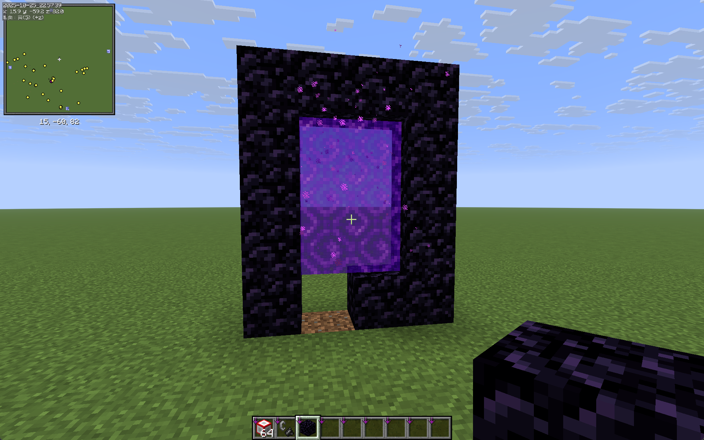
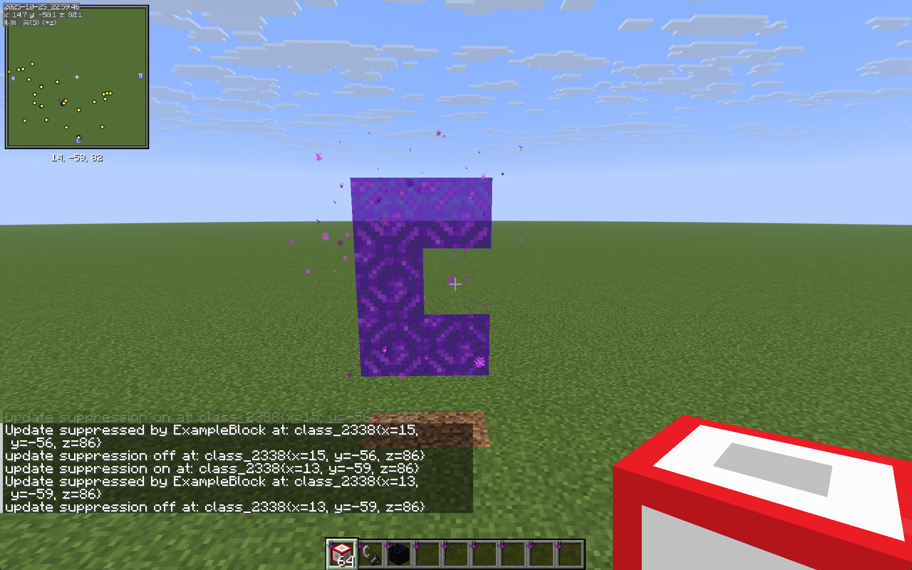

# Better Update Suppression 更好的更新抑制

## 如何使用？

1. 下载`BetterUpdateSuppression-1.0-SNAPSHOT.jar
`，放入mods文件夹
2. 输入指令给予自己更新抑制方块
    ```
    /give @s better_update_suppression:update_suppression_block 64
    ```
3. 在更新抑制前搭好结构（以切门为例）
   
4. 将`更新抑制方块`紧贴放置需要抑制的方块旁边
   
5. 右键`更新抑制方块`，中心灰色部分变红即为激活状态
   
6. 敲掉黑曜石！此时会触发更新抑制，地狱门不会破碎
   
7. 再次右键`更新抑制方块`，取消激活状态，中心红色部分重新变灰
   
8. 破坏`更新抑制方块`
   
9. 如法炮制可以把黑曜石全部去除（不小心缺了一个）
   

## 注意事项
1. 更新抑制轻则崩服，重则崩档，**使用前务必备份存档！！！非常重要！！！**
2. 如何避免崩档崩服？
    - carpet mod 开启更新抑制崩溃保护
    - 不要把两个`更新抑制方块`紧贴放置，即使没有激活
    - 慢慢操作，不要急躁

依赖模组：fabric，fabric-api